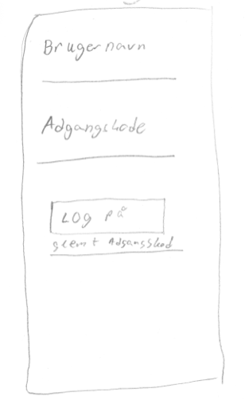
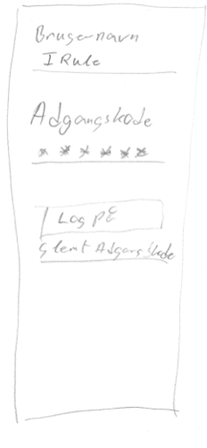
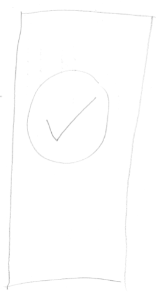

# Brugertest
Når vi designer produkter, så er vi nødt til at forholde os til om brugeren kan anvende produktet på den måde det var tiltænkt. Vi har en hjælp i prototyper, fordi de på et tidligt stadie i processen med at designe kan hjælpe os til at undgå problemer, der være vanskelige at løse senere.

Der findes utrolig mange måder at undersøge produkter på. Så vi nøjes med at præsentere én her, som har den fordel, at den er hurtig at udføre og giver en del brugbar feedback.

## Tænke-højt-test
En tænke-højt-test foregår ved, at vi beder en person om at bruge vores prototype, og tænke højt imens de gør det. Det lyder simpelt, men der er (mindst) to faldgrubber. Den første er, at fortæller testpersonen præcis, hvad vedkommende skal gøre. For eksempel, at man siger, først trykker du på den knap, så den knap og så... Det fratager testpersonen muligheden for at tænke og så får vi ikke undersøgt noget. Den anden faldgrubbe er, man spørger de forkerte. Det kan være at har lavet noget til pensionister, men tester det på ens klassekammerater. 

Med disse betragtninger i baghovedet, kan vi opstille en fremgangsmåde for test af prototyper med tænke-højt-testen
1. Begynd med at finde den/de ting i ønsker at undersøge med prototypen (I kan for eksempel spørge: Kan brugeren logge på?).
2. Find en bruger som faktisk kunne tænkes at anvende produktet og få vedkommende til at være testperson.
3. Fortæl testpersonen overordnet, hvad produktet skal kunne (I kan for eksempel sige: Det er udstyr, der skal få en til at gå i et bestemt tempo).
4. Giv testpersonen en opgave som skal udføres med prototypen (I kan for eksempel: Du skal forsøge at logge på).
5. Bed testpersonen om at tænke højt imens vedkommende udfører opgaven.
6. Skriv ned, hvad der sker, især er handlinger, der ikke er forventet interessante.

For at forstå hvordan tænke-højt-test virker giver vi et eksempel

## Eksempel på tænke-højt-test
I dette eksempel vil vi anvende [papirprototypen](prototyper.md#papirprototyper) fra det sidste afsnit. For at papirprotypen kan anvendes klipper vi en ud i 3 dele, så testpersonen kun skal forholde dig til ét skærmbillede af gangen. Når der skal ske noget skifter vi billedet ud.

Eksemplet forgår som en tænkt samtale mellem _testeren_ (den der har lavet prototypen) og _testpersonen_ (den der skal tænke højt).

**Tester**: Vi har lavet en app, og vi vil gerne undersøge om brugerne kan logge på. Så lige om lidt giver jeg dig et skærmbillede som skal forestille loginskærmen. Jeg vil godt bede dig om at lade som du logger ind. Imens du gør det vil jeg gerne have, at du tænker højt. Det vil sige, at du giver os dit indtryk af skærmen og fortæller os, hvad du mener, at du skal gøre. Og så skal lade som om, at gør det.

**Testperson**: Forstået.

_Testeren lægger følgende på bordet foran testpersonen_

**Testperson**: Den er godt nok grim. Det er svært at læse teksten. Men jeg tror, at jeg vil trykke på linjen under burgernavn for at taste det ind.

_Testeren skifter skærmbilledet ud med følgende_

**Testeren**: Vi har udfyldt brugernavn og adgangskode dig.

**Testperson**: Ikke det bedste brugernavn, kunne man ikke bruge sin e-mail i stedet? Nå men jeg skal vel trykke på "log på" knappen... burde det ikke være log in? Og hvorfor er den glemt adgangskode så stor?

_Testeren skifter skærmbilledet ud med følgende_

**Testperson**: Nå så er jeg logget på, hvad sker der så? Hvordan kommer jeg videre?

Eksemplet er måske ikke helt realistisk, men illustrerer ideen bag tænke-højt-testen. Resultatet af denne test er, at designerne nu ved nogle ting om hvad der skal arbejdes med:
1. Valg af font (teksttype) er vigtig.
2. Brugeren vil gerne kunne bruge e-mail til at logge på. 
3. Der kan være noget med sprog "log på" kontra "log in"
4. Størrelser mellem knapper og andet skal der arbejdes med.
5. Overordnet kan testpersonen godt logge på, så det er det kosmetiske, der skal arbejdes med.

## Afrunding
Oven for har vi præsenteret tænke-højt-testen og givet et eksempel med en papirprototype. Når vi tester fysiske prototyper, så gør vi det samme. Men der er en ekstra ting vi skal notere os. Nemlig, hvordan testpersonen opfører sig rent fysisk. For eksempel hvor ser vedkommende hen, hvordan bevæger vedkommende sig og så videre. Da den [fysiske prototype](prototyper.md#fysiske-prototyper) i sidste afsnit blev testet, kiggede alle testpersonerne på displayet med lysdioder. I stedet for at se, hvor de gik. Det kunne være en potentiel fare, at folk ikke er opmærksomme i trafikken, når udstyret anvendes. Det gav anledning til at undersøge om, der var andre metoder til at fortælle brugeren om vedkommende gik i det rigtige tempo.