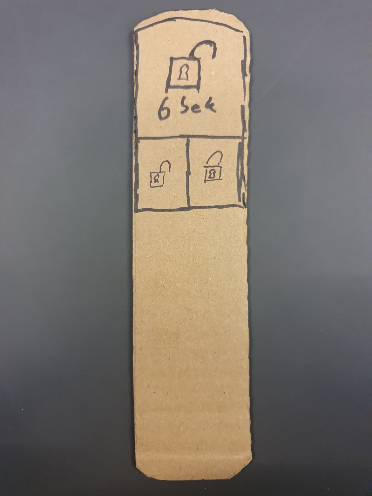
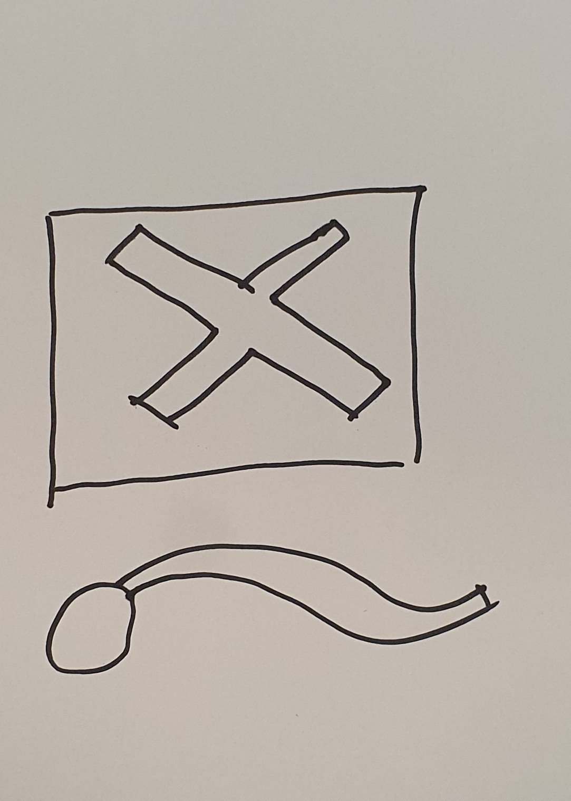
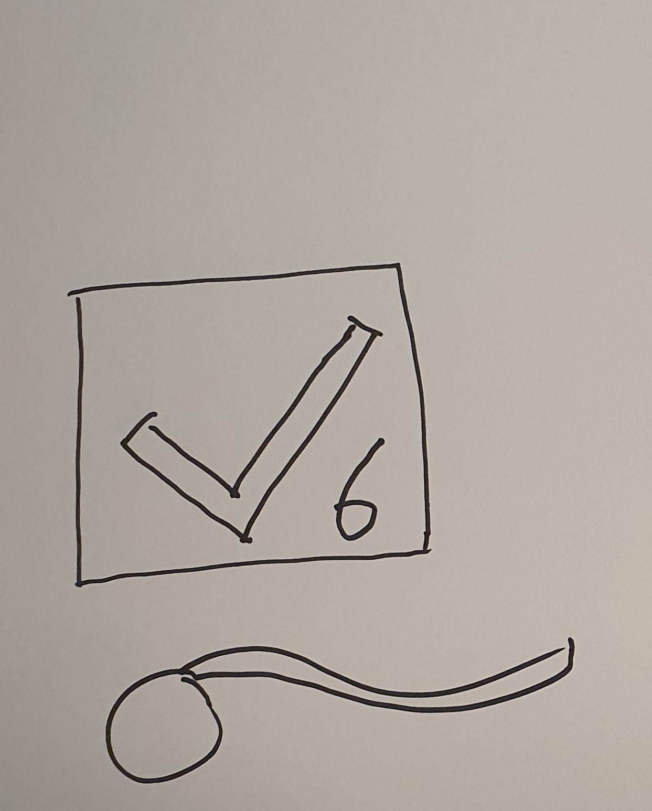
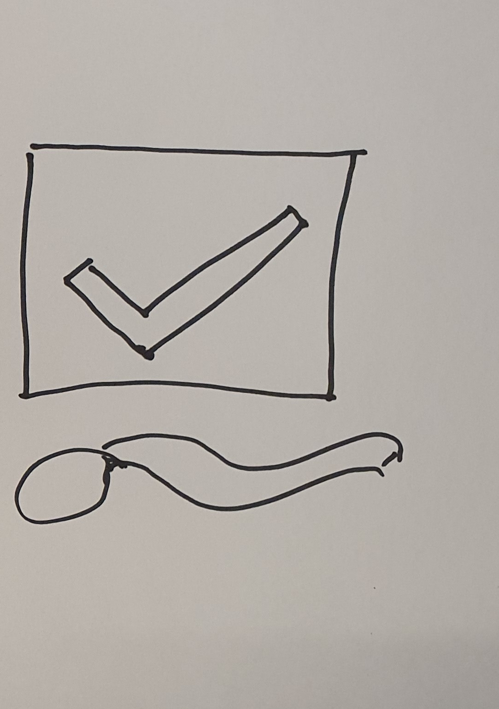

# Brugertest
Når vi designer produkter, så er vi nødt til at forholde os til, om brugeren kan anvende produktet, på den måde det var tiltænkt. Vi har en hjælp i prototyper, fordi de, på et tidligt stadie i processen med at designe, kan hjælpe os til at undgå problemer, der være vanskelige at løse senere.

Der findes utrolig mange måder at undersøge produkter på. Så vi nøjes med at præsentere én her, som har den fordel, at den er hurtig at udføre, og giver en del brugbar feedback.

## Tænke-højt-test
En tænke-højt-test foregår ved, at vi beder en person om at bruge vores prototype, og tænke højt imens de gør det. Det lyder simpelt, men der er (mindst) to faldgrubber. Den første er, at fortæller testpersonen præcis, hvad vedkommende skal gøre. For eksempel, at man siger, først trykker du på den knap, så den knap og så... Det fratager testpersonen muligheden for at tænke og så får vi ikke undersøgt noget. Den anden faldgrubbe er, man spørger de forkerte. Det kan være, at man har lavet noget til pensionister, men tester det på ens klassekammerater. 

Med disse betragtninger i baghovedet, kan vi opstille en fremgangsmåde for test af prototyper med tænke-højt-testen. Vi vil anvende [papirprototypen](prototyper.md#papirprototyper) fra sidste afsnit som eksempel.
1. Begynd med at finde den/de ting i ønsker at undersøge med prototypen (I kan for eksempel spørge: Kan brugeren låse døren op?).
2. Find en bruger som faktisk kunne tænkes at anvende produktet og få vedkommende til at være testperson.
3. Fortæl testpersonen overordnet, hvad produktet skal kunne (I kan for eksempel sige: Det er en elektronisk lås til en hoveddør).
4. Giv testpersonen en opgave som skal udføres med prototypen (I kan for eksempel give opgaven: Lås døren op).
5. Bed testpersonen om at tænke højt imens vedkommende udfører opgaven.
6. Skriv ned, hvad der sker, især er handlinger, der ikke er forventet interessante.

For at forstå hvordan tænke-højt-test virker giver vi et eksempel

## Eksempel på tænke-højt-test
I dette eksempel vil vi anvende [papirprototypen](prototyper.md#papirprototyper) fra det sidste afsnit. For at papirprotypen kan anvendes klipper vi en ud i 3 dele, så testpersonen kun skal forholde dig til ét billede af gangen. Når der skal ske noget skifter vi billedet ud.

Eksemplet forgår som en tænkt samtale mellem _testeren_ (den der har lavet prototypen) og _testpersonen_ (den der skal tænke højt).

**Tester**: Vi har lavet et elektronisk låsesystem, som vi ønsker at teste. Så om lidt får du et stykke pap, der skal fungere som nøgle, og vi viser med et stykke papir, hvordan døren ser ud. Vi vil godt bede dig om at låse døren op. Imens du gør det vil vi gerne have, at du tænker højt. Det vil sige, at du giver os dit indtryk af nøglen og døren og fortæller os, hvad du mener, at du skal gøre. Og så skal lade som om, at gør det.

**Testperson**: Forstået.

_Testeren giver følgende nøgle til testpersonen._

_Testeren lægger følgende billede af døren på bordet foran testpersonen._

**Testperson**: Nøglen er godt nok grim. Det er svært at læse teksten. Men jeg tror, at jeg vil trykke på den store knap øverst for at låse op.

_Testpersonen lader som om, der trykkes på den store knap i toppen._

_Testeren skifter billedet af døren ud med følgende._

**Testeren**: Nu viser døren dette.

**Testperson**: Ok, nu er døren åben. Men hvorfor står, der 6 i højrehjørne.

_Testeren skifter efter 6 sekunder billedet af døren ud med følgende._

**Testperson**: Hov nu er døren låst igen. Det gik hurtigt. Hvis jeg havde vidst det, havde jeg skyndt mig lidt. Måske skulle jeg bruge den lille lås-op-knap. 

_Testpersonen lader som, der trykkes på den lille knap nederst til venstre på nøglen._

_Testeren skifter billedet af døren ud med følgende._

**Testperson**: Nu er døren åben og uden sekstal. Men hvorfor er der egentlig et kæmpe ikon, der fortæller om døren er låst? Jeg vil nok _ikke_ ønske, at min dør fortalte uønskede gæster, at den ikke er låst.

Eksemplet er måske ikke helt realistisk, men illustrerer ideen bag tænke-højt-testen. Resultatet af denne test er, at designerne nu ved nogle ting om hvad der skal arbejdes med:
1. Overordnet, så kan brugerne godt anvende prototypen.
2. Vi bør overveje om 6 sekunder er nok, eller om det er nået brugeren hurtigt kan lære.
3. Der er et sikkerhedsaspekt i om døren visuelt skal fortælle om den er låst eller ej.

## Afrunding
Oven for har vi præsenteret tænke-højt-testen og givet et eksempel med en papirprototype. Når vi tester fysiske prototyper, så gør vi det samme. Men der er en ekstra ting vi skal notere os. Nemlig, hvordan testpersonen opfører sig rent fysisk. For eksempel hvor ser vedkommende hen, hvordan bevæger vedkommende sig og så videre. Da den [fysiske prototype](prototyper.md#fysiske-prototyper) i sidste afsnit blev testet, kiggede alle testpersonerne på displayet med lysdioder. I stedet for at se hvor de gik. Det kunne være en potentiel fare, at folk ikke er opmærksomme i trafikken, når udstyret anvendes. Det gav anledning til at undersøge om, der var andre metoder til at fortælle brugeren om vedkommende gik i det rigtige tempo.