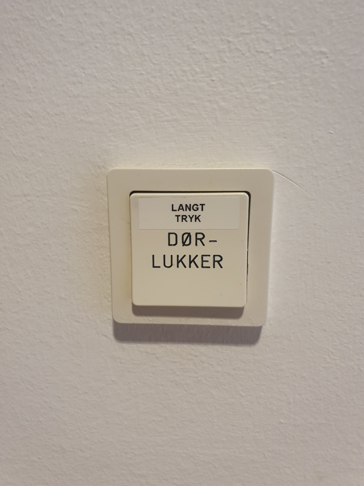

# Feedback

|Definition: Feedback|
:-|
|Hvad gør tingen lige nu? Hvilken handling er blevet udført?|

Med andre ord, om vi kan afgøre, hvad der sker nu og om den handling vi har udført faktisk er sket.

## Et eksempel på dårlig feedback

Denne knap har faktisk feedback: Den fortæller, at den er blevet trykket ind - det kan vi mærke. Men det er knap der springer ud igen, så feedback kommer for tidligt og forvirrer. Derfor har nogen sat et dymo-label på knappen. 

## Et eksempel på god feedback

Igen er knapper gode til at fortælle os, at vi har trykket på dem. Vi kan simpelthen mærke, at vi har haft succes med at trykke på en knap. Vi behøver ikke at se efter.