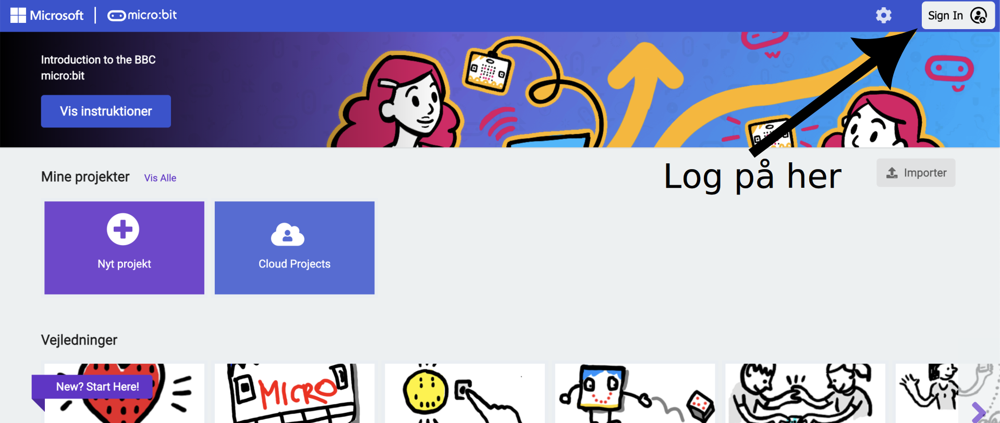
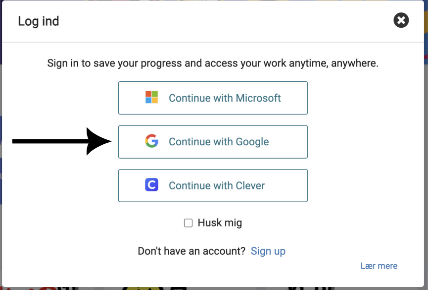
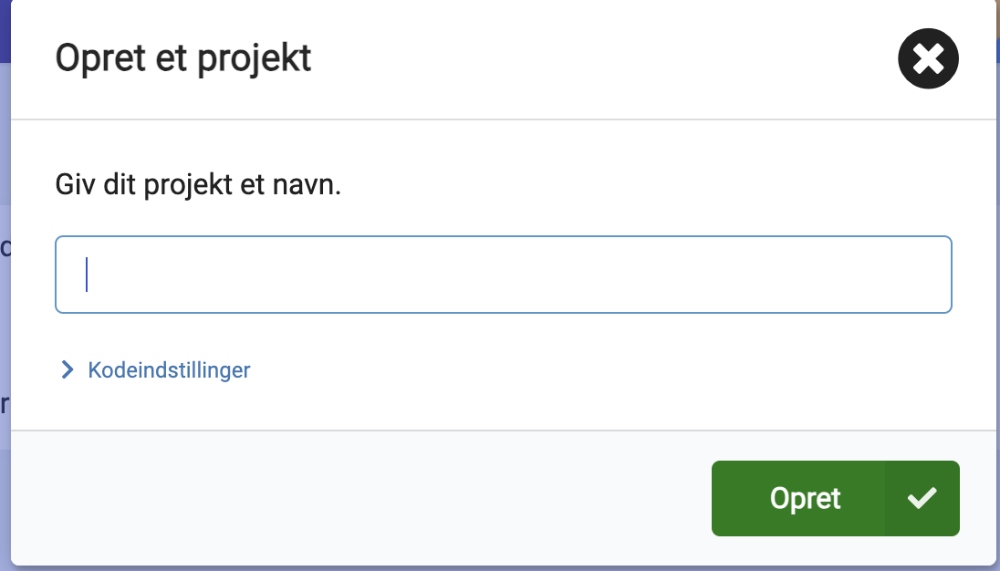
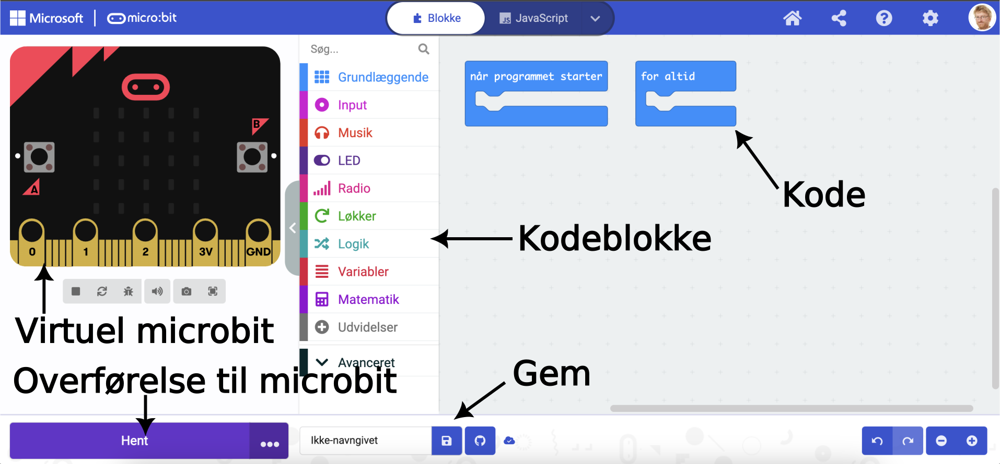

# Introduktion til micro:bit

Vi vil nu vende os mod micro:bit, og hvordan de programmeres. Dette er ikke tænkt til at være en fuldstændig udtømmende guide til alt, hvad en micro:bit kan, men derimod en kort gennemgang af de vigtigste elementer. Selve micro:bit-enheden kan man læse om [her](https://microbit.org/get-started/features/overview/). Der er mange egenskaber, og alt for mange til at det giver mening at beskrive dem her.

Vi vil benytte [makecode](https://makecode.microbit.org/) som platform for vores programmer. Når man kommer ind på makecode er det første man skal gøre at logge på.

Man skal vælge hvad man vil logge på med. Google er et godt bud. Man kan også bede om at blive husket.

Fordelen ved at logge på er ens projekter bliver glemt. Og de kan findes igen. Man også begynde et nyt projekt.

Hvis vi vælger et nyt projekt kan vi også give det et navn. Her er det vigtigt, at vi kalder projektet noget meningsfuldt, så vi kan finde det igen senere.

Når vi kommer ind på vores projekt bliver vi præsenteret for følgende.

Øverst til venstre har en virtuel micro:bit, der kan anvendes til at afprøve vores kode. I midten har vi en menu med de blokke vi kan anvende til at programmere med. De kan placeres til højre, hvor der er to kodeblokke, alle micro:bit programmer er født med. Nederst har vi en stor blå knap, hvor der står "hent". Den kan vi trykke på for at overføre vores program til en micro:bit-enhed. Vi har som det sidste også mulig for at gemme vores projekt.

Bemærk farverne!

Farverne af kodeblokkene stemmer overens med farverne af menupunkterne. Det vil sige, at hvis man ser på noget kode andre har lavet, så kan man selv finde deres blokke ved den tilsvarende farve i menuen.

