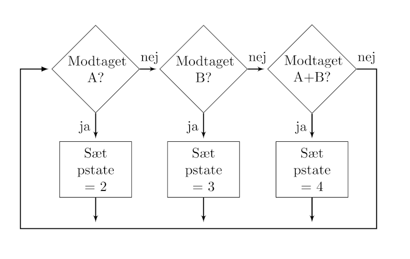
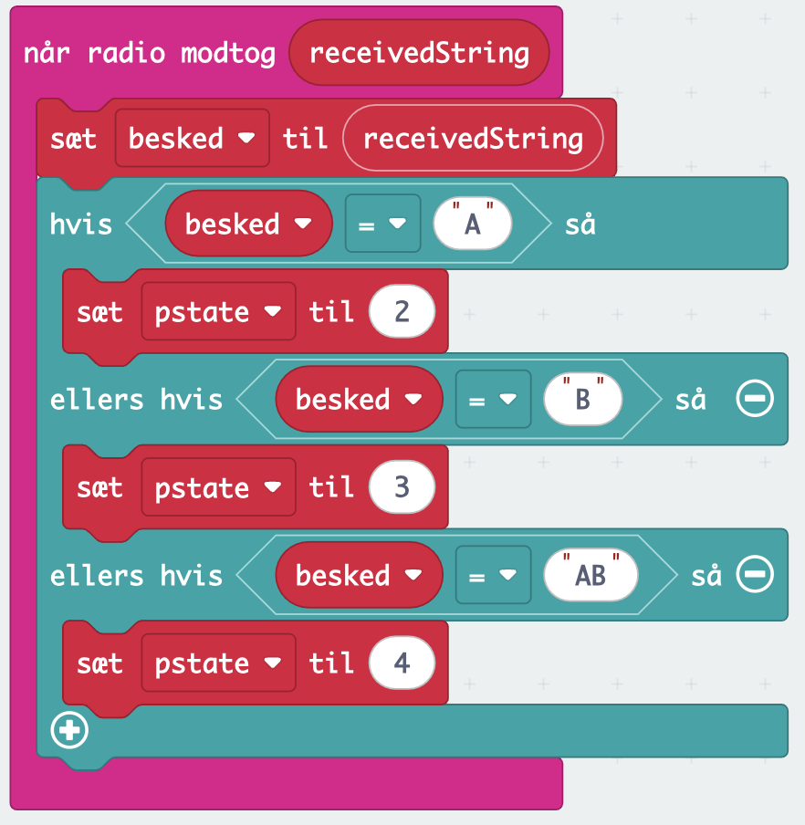
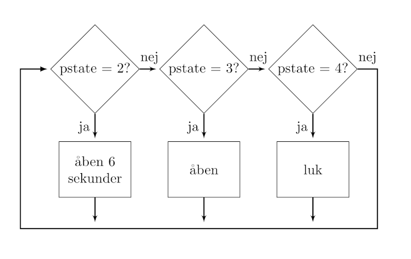
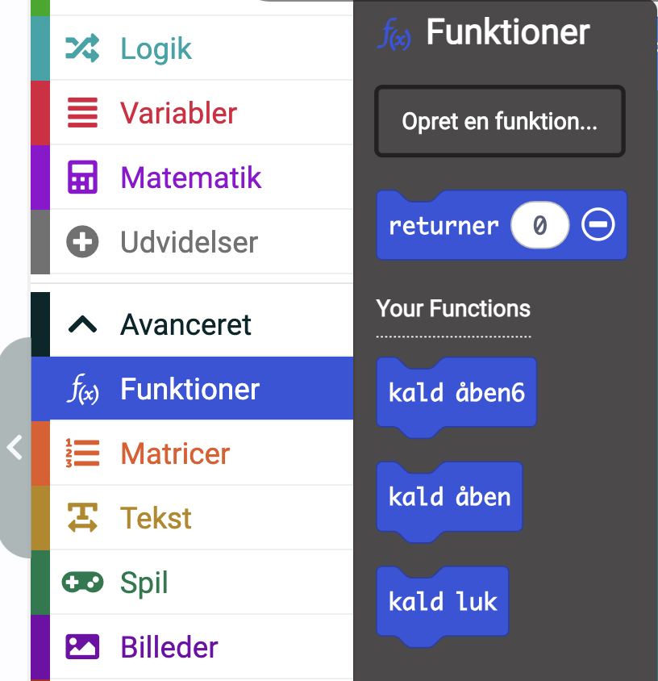
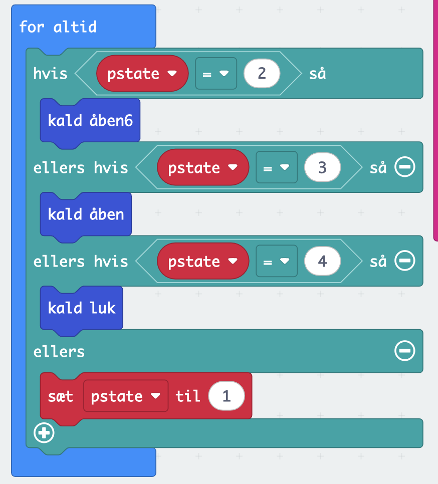
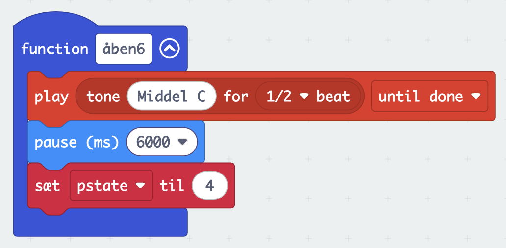
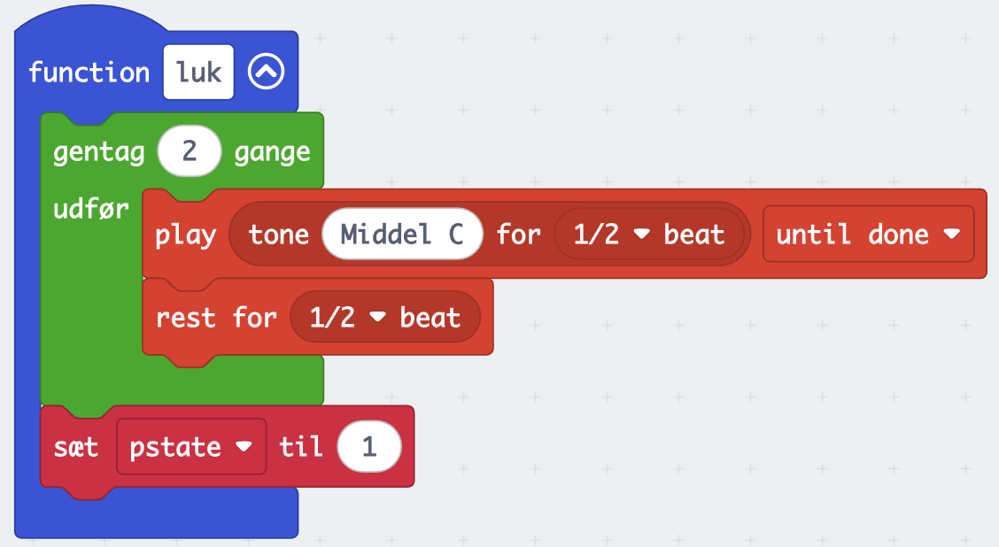
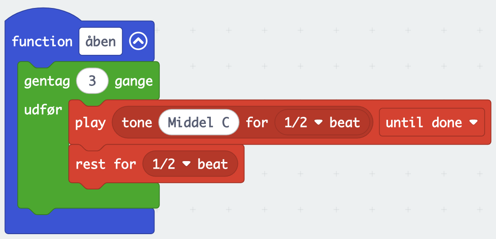
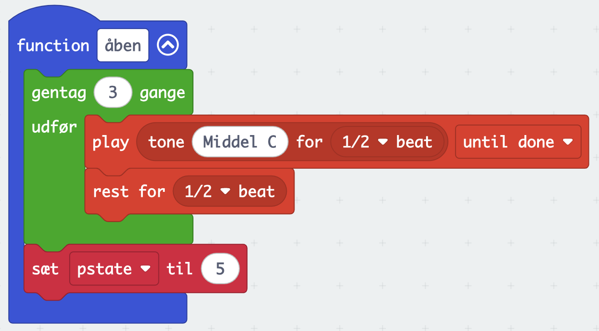
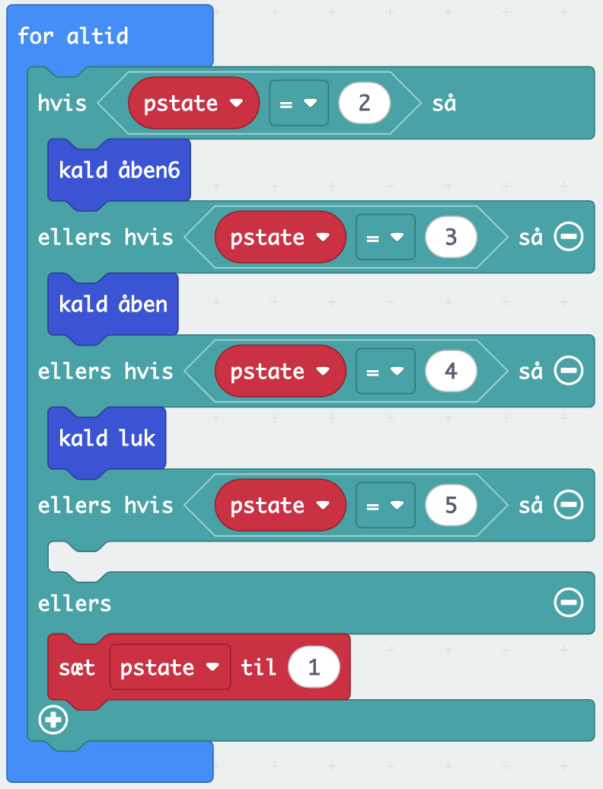

# Kode

Vi kan nu skrive noget kode. Fordi det er en prototype, vil vi ignorere den faktiske "lås og lås op" mekanisme, og i stedet anvende micro:bittens lyd til at vise om døren er låst eller ej. På samme måde vil vi ignorere alle mulige problemer med sikkerhed i vores setup. Vi er ude på at teste om en interaktion, som ikke er i nærheden af et endeligt produkt.

Da nøglen er den letteste at programmere, så begynder vi med den.

## Nøglen
Nøglen skal sætte en radiogruppe, som svarer til den låsen har. I dette eksempel vælger vi gruppen 17. 

Når dette er gjort, så skal vi "bare" sende "A", "B" eller "AB" alt efter om, der er trykket på knap A, knap B eller begge knapper. Vi viser koden for alle tilfælde:

Vi har nu koden for nøglen. Nu mangler vi låsen.

## Låsen
Vi begynder med at sætte radiogruppen og variablen "pstate" (program state) til 1 (låst), når programmet starter.

Når det er gjort, giver det mening, at se på modtagelsen af beskeder fra nøglen, da det er her tilstandene bliver ændret af brugeren. Vores rutedigram ser således ud:

Det sættes ind i en "når radio modtog..." blok.

Nu kan vi ændre tilstand alt efter, hvad brugeren har trykket på nøglen. 

Nu mangler vi bare, at der sker noget. Vi har et rutediagram for den uendelige løkke, der er hoveddelen af vores program.

De tre processer "åben i 6 sekunder", "åben" og "luk". Vil vi lave som funktioner. Det vil sige, at vi finder på nogle navne, der henviser til noget kode et andet sted. På den måde bliver den uendelige løkke ikke overproppet med kode, og vi kan lettere se, hvad vi skal gøre.

Vi opretter funktionerne "åben6", "åben" og "luk". Navnene burde være selvforklarende. Funktionerne kan så kaldes fra den uendelige løkke.

Bemærk, at vi sætter "pstate" til 1, hvis ingen af de andre tilstande bliver valgt, på den måde er vi nogenlunde sikker på altid at være i en gyldig tilstand.

Nu kan vi lave de enkelte funktioner. Vi begynder med tilstanden, hvor døren er åben i 6 sekunder. Her skal der lyde et bip, vi skal vente i 6 sekunder, og så skifte til tilstand 4, hvor der lukkes. Det ser sådan ud:

Eftersom koden går videre til tilstand 4, så tager vi den tilstand nu. Her skal der bippes to gange og skiftes til tilstand 1 (låst). Måden vi får micro:bitten til at bippe to gange, er ved at lave en lille løkke, hvor der kommer et bip og så en pause. Og det gør vi så to gange. Til sidst sætter vi "pstate" til 1 for at vende tilbage til tilstand 1 (låst).

Nu mangler vi "bare" den sidste tilstand (3), hvor døren er åben. Vi skal bippe tre gange, også skal der bare ventes på, at der bliver låst. Vi laver tre bip, på samme måde som 2 bip, men med én ekstra gentagelse.

### Hurra vi har begået en fejl!

Hvis man forsøger at bruge den kode vi har lavet. Så vil man støde ind i et problem. Nemlig, at hvis man trykker åben på nøglen, så bliver låsen ved med at bippe indtil, man låser igen. Det var ikke helt det, det skulle ske. Vi skal kun bippe 3 gange. Problemet er, at vi har overset en tilstand. Nemlig, at bippe tre gange og vente ikke er det samme. Så vi er nødt til at lave en ventetilstand. Vi har brugt tallene 1, 2, 3, og 4, så den nye tilstand bliver nr. 5. Vi ændrer åbnefunktionen, så den skifter til tilstand 5 og vi ændrer den uendelige løkke til at have en tilstand 5, hvor der ikke sker noget.

Åbenfunktionen vil så se sådan ud:

Og den uendelige løkke vil se sådan ud:

Dette afslutter eksemplet på anvendelse af storycoding.
