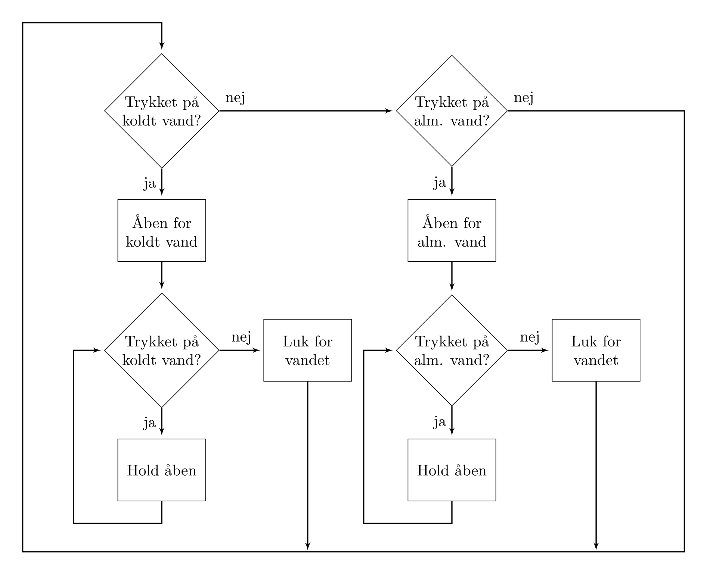
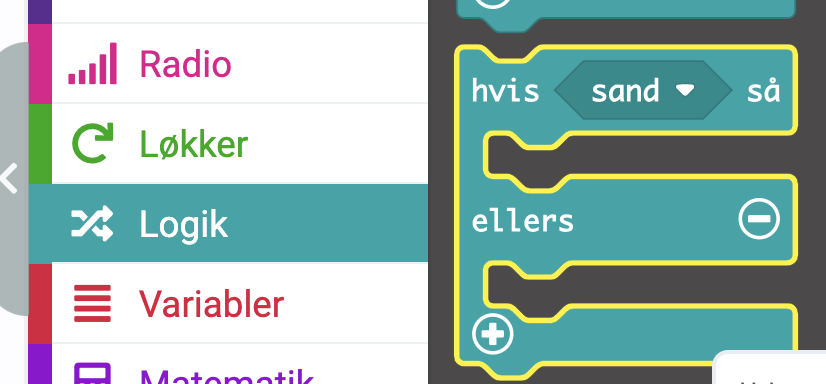
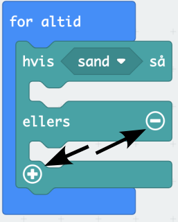
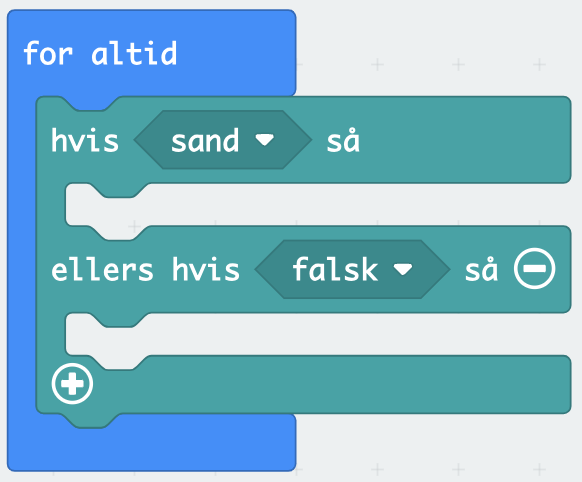
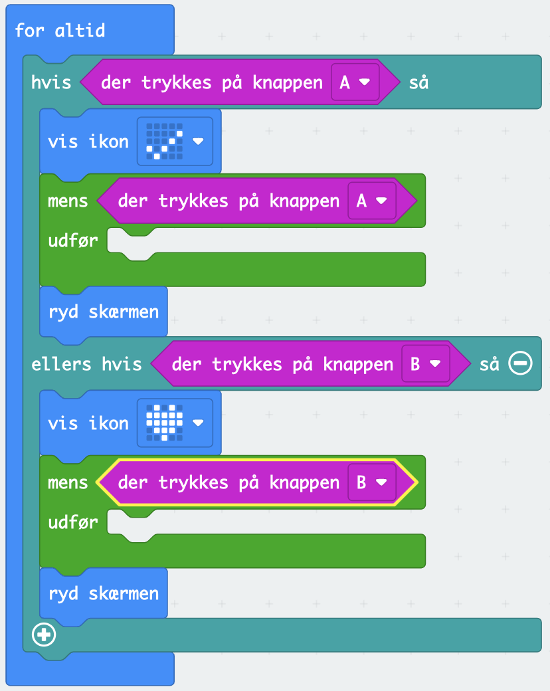

# Løkker og forgreninger

Micro:bit har en løkke, der kører indtil den bliver slukket. Blokken ser således ud:

Alt hvad der inden for denne blok vil blive kørt igen og igen indtil der ikke er mere strøm. Vi kan få dioder på en micro:bit til at blinke ved først at vise noget, så ryde "skærmen" også vente. 

Kodedelene til dette findes alle under "Grundlæggende" (eng: basic). Dette er ikke særligt interessant, men det viser hvordan "for altid"-løkken virker.

## Vandautomaten

Vi vil nu prøve at programmere [vandautomaten](./pc.md#et-eksempel). Dog vil selve det at åbne og lukke for vandet være noget som vi ikke har mulighed for. Så i stedet vil vi vise med micro:bittens dioder, at der er tændt for koldt eller almindeligt vand.

En micro:bit har to knapper A og B, som vi vil anvende. Knap A vil være koldt vand, og knap B vil være almindelig vand. Vi skal så omforme rutediagrammet for vandautomaten til kode.

Vi begynder med en uendelig løkke. 

Det første vi skal have er en forgrening. De ligger under *logik*. Der er to slags. vi benytter nummer to.

Den indsætter vi i vores "for altid" løkke. Forgreningen kan forkortes og forlænges ved at anvende plus og minus på blokken.

Vi trykker en gang på plus og en gang på minus, så det kommer til at se sådan ud.

Vi har nu samlet de to øverst forgreninger i vores rutediagram, men vi mangler at spørge om knapperne er trykket. Det kan vi finde under input.

Det sætter vi på de to pladser i vores forgrening. I den hvor der står "ellers hvis" retter vi A til B.

Så skal der sættes kode ind under hver gren. Vi skal have have vandet til åbne og lukke. Vi vælger to ikoner til varmt vand og koldt vand og når vandet skal slukkes, så rydder vi dioderne.

Dog er dette ikke godt nok. Programmet vil hele tiden tænde og slukke for vandet og det dur ikke vi må gøre noget andet. I rutediagrammet havde vi også en to forgreninger, der undersøgte om knappen var trykket ned og derfor holdte vandet åbent eller lukkede for vandet.

Denne type forgrening, der hele tiden vender tilbage til sig selv er et eksempel på en løkke. De finder under løkker. Vi skal have fat i den der hedder "mens ... udfør"

Men hvad skal, der så ske i løkken. Svaret er der skal ske ingenting. For der er åbnet for vandet og det giver ikke mening at åbne igen. Så vi indsætter de to løkker i vores kode, og tilføjer de to tjek af knapperne A og B henholdsvis.

Dette færdiggør vores program til vandautomaten.