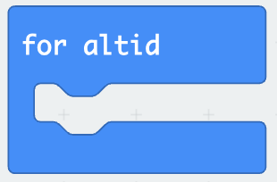

# Løkker

Micro:bit har en løkke, der kører indtil den bliver slukket. Blokken ser således ud:

Alt hvad der inden for denne blok vil blive kørt igen og igen indtil der ikke er mere strøm. Vi kan få dioder på en micro:bit til at blinke ved først at vise noget, så ryde "skærmen" også vente. 

Kodedelene til dette findes alle under "Grundlæggende" (eng: basic). Dette er ikke særligt interessant, men det viser hvordan "for altid"-løkken virker.

Vi kan også lave løkker, der kun kører kortvarrigt. Der findes forskellige af denne type løkker og de findes alle under menuen "løkker". Et eksempel på noget kode kunne være.

Kodeblokkene er sat ind i den overordnede blok "når programmet starter", hvilket betyder, at koden bliver udført, når en micro:bit får strøm og så ikke igen (med mindre nogen trykker på reset-knappen).

Den grønne blok, har noget der hedder et index, der stiger med én, hver gang løkken kører, men den stopper, når vi har nået 2. Det vil sige, at index starter som 0, så bliver den 1 og til sidst to. Med andre ord er index noget forskelligt, hver gang løkken bliver udført. Der er tre tal mellem 0 og 2 (nemlig 0,1, og 2). Løkken bliver udført tre gange. Det der vises på dioderne er dog ikke index, men derimod 3-index. Vi kan lave en tabel med resultat af 3 - index, for hver gennemkørsel.

|index|3 - index|
|-|-|
|0|3-0=3|
|1|3-1=2|
|2|3-2=1|

Med andre ord tæller løkken ned fra tre til en. Den løkke vi oftest vil anvende er "for altid".

En micro:bit har mange sensorer, der gør den i stand til mere interessante ting end at vise noget med dioder. Det er emnet for næste afsnit.