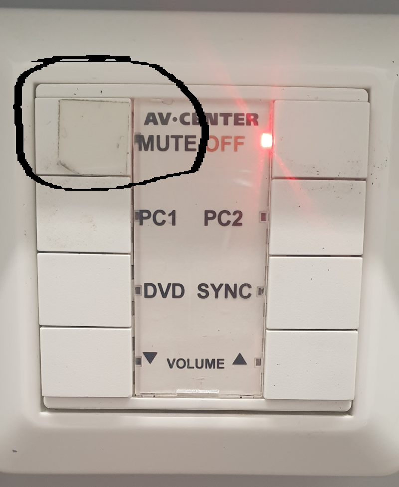

# Mapping

|Definition: Mapping|
:-|
|Er der en sammenhæng mellem input og output?|

## Et eksempel på dårlig mapping

Dette er knapperne til at betjene en projektor. Der er præcis ét kabel, man kan sætte sin computer for at anvende projektoren. Men det "mute"-knappen, der skal trykkes på for at få forbundet computer og projektor! Hvilket nok er den sidste knap nogen ville trykke på.

## Et eksempel på god mapping

Den store knap på denne brødrister har en fantastisk mapping. Når den trykkes ned, så kommer brødet også ned i brødristeren. Og når den kommer op, så kommer brødet også op.