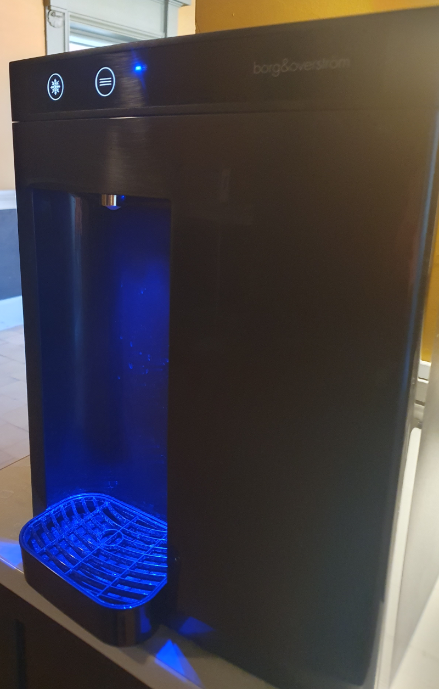

# Programmer og computere

Moderne mennesker omgiver sig med computere. Ikke kun dem vi kan se, for eksempel bærbare, men også i utroligt meget udstyr som umiddelbart ikke forbindes med computere. 

En computer består typisk af en samling microchips, der ligger på et printkort. Det er det vi kalder *hardware*. For at få en computer til at gøre noget bestemt, er der nødt til at være nogle instruktioner til computeren om, hvad den skal gøre det er det vi kalder *software*. Software skal skrives, hvilket vi kalder at programmere. 

I en designsammenhæng er udfordringen, at computere og mennesker er meget forskellige. Vi har noget vi som mennesker er gode til og computere har noget de er gode til. Vi kan forsøge at stille det op i en tabel.

|Mennesker kan|Computere kan|
|-|-|
|leve fint med manglende præcission. Fx 'jeg er der om ca. fem minutter' | kun arbejde med præcise oplysninger. Fx 'fem minutter er 300 sekunder|
|udføre en handling uden at kende alle skridt i handlingen. Fx at gå ud med skraldet | kun udføre en handling, hvis den kender alle skridt i handlingen|
|overføre viden fra tidligere situationer og generalisere | ikke overføre viden fra tidligere situationer og generalisere|
|glemme| ikke glemme|

Listen kan gøres længere, men burde illustrere, hvad udfordringen med at skrive computerprogrammer, der skal bruges af mennesker er. Vi vil i de næste to afsnit give nogle værktøjer til at modellere computere. Nemlig [tilstandsdiagrammer](./tilstand.md) og [rutediagrammer](./rute.md). Men først et eksempel som vi vil analysere.

## Et eksempel
Da denne lille bog handler om fysiske prototyper giver vi nu et eksempel på et fysisk system.

Billedet viser en vandautomat. Øverst er der to knapper. Knappen til venstre med et snefnugikon får vandautomaten til udlevere koldt vand. Den anden knap får automaten til at levere almindelig vand lige som en vandhane. For begge knapper gælder det, at de skal holdes inde sålænge vande skal flyde. Lige så snart man slipper knappen, så stopper vandet (dog med en smule forsinkelse).

Vi forestiller os, at en lille computer åbner og lukker for vandet, når en af knapperne bliver trykket. Vi vil gerne oversætte det til noget, der nærmer sig det computeren skal gøre. Det første trin er et tilstandsdiagram. 