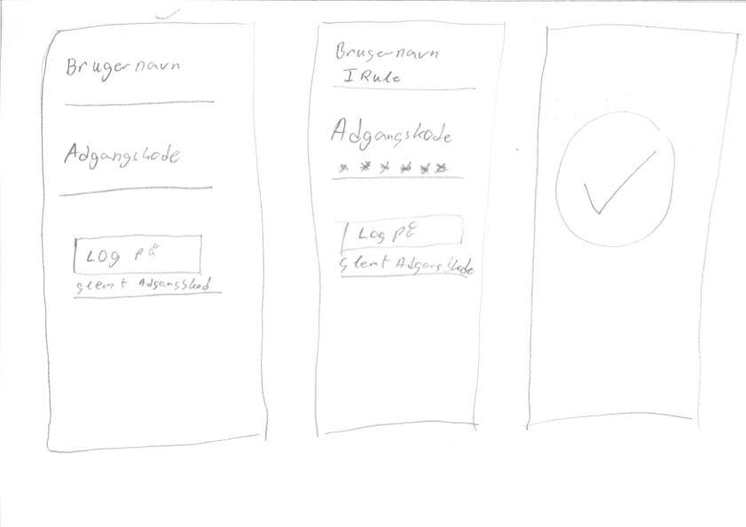
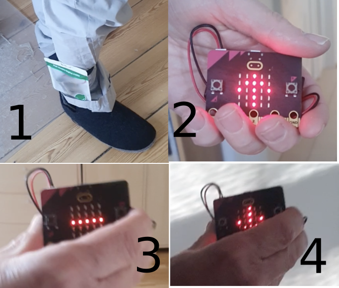

# Prototyper

Design handler om at skabe objekter eller programmer, der kan hjælpe mennesker til at opnå noget bestemt. Vi vil i denne bog bruge en samlet betegnelse _produkt_ om det der skabes. Heri ligger der, at det _ikke_ nødvendigvis er et kommercielt produkt, der skal ud på et marked og sælges. Det kan også være noget som ikke skal tjene penge til nogen. Så ordet produkt betyder i følgende "bare" det, der skal desinges.

Når vi designer et produkt til nogen, så kunne en tilgang være at skabe vores produkt og så sende det ud på markedet. Det vil ikke være en god idé! For hvordan kan vi vide, at nogen faktisk er interesseret i vores produkt? Hvordan kan vi vide om nogen kan finde ud af at anvende vores produkt? Og hvordan sikrer vi at produktet faktisk opfører sig som tænkt, når det kommer ud i den virkelige verden?

Svaret på disse spørgsmål er, at vi laver _prototyper_ af produktet. En prototype kan defineres således:

|Definition: Prototype|
:-|
|En prototype er et objekt, der i et eller andet omfang ligner det endelige produkt, men som har ingen eller få af det endelige produkts egenskaber| 

Formålet med prototypen er at have noget som vi kan vise en bruger og som vi kan få feedback på. Vi behandler brugertest i det næste afsnit. Men først ser vi på forskellige typer af prototyper.

## Lo-fi og hi-fi prototyper

Der eksisterer rigtig mange former for prototyper. Så derfor giver det mening at inddele dem alt efter, hvor tæt de er på det endelige produkt. Vi anvender betegnelserne lo-fi og hi-fi. Betegnelsen lo-fi kommer af det engelske "low fidelity", hvilket kan oversættes til "lav trofasthed". Det betyder i denne sammenhæng, at prototypen er langt fra det endelige produkt. For eksempel kan der være forskel i anvendelsen af materialer, eller at prototypen overhovedet ikke ligner rent fysisk det tænkte produkt.

Den anden betegnelse hi-fi kommer også fra engelsk og betyder "high fidelity", hvilket kan oversættes til "høj trofasthed". En hi-fi prototype vil være tæt på det endelige produkt, enten i udseende eller i funktionalitet (eller begge del).

Det vigtigt at holde sig for øje, at inddelingen lo-fi og hi-fi ikke er to kasser, men derimod et spænd. Det vil sige, at vi kan tale om at prototyper kan være mere eller mindre lo-fi eller mindre eller mindre hi-fi. Hvor skiftet mellem lo-fi og hi-fi, så ligger kan der ikke gives noget endegyldigt svar på. Men en tommelfingerregel kunne være at vi nærmere hi-fi end lo-fi, når enten prototypens udseende eller dens virkemåde er tæt på det endelige produkt.

### Papirprototyper
Den første prototype, det giver mening at lave, vil i langt de fleste tilfælde være en papirprototype. Denne prototype laves ved at man tager et stykke papir og så tegner. Det kan være der tegnes omridset af en mobiltelefon, hvori der tegnes knapper og lignende, der udgør en apps brugergrænseflade. Hvis det er en micro:bit, så tegner man en micro:bit. 

Formålet er at hurtigt at få lavet en skites af det vi har tænkt og som vi hurtigt kan afprøve. Hvis ideen bag prototypen viser sig at være dårlig, så skal vi smide prototypen ud og prøve med noget andet. Derfor er det vigtigt, når man laver en papirprototype, at man ikke bruger en masse tid på at lave **pæne** tegninger. Jo mere energi, der brugt på at lave en papirprototype, jo sværere er det at smide den ud bagefter. Så faren ved pæne tegninger er, at man holder fast på en dårlig idé, fordi man har investeret for meget i den.

Ideen med papirprototyper er at lave flere tegninger, der hver især viser forskellige skærmbilleder alt efter, hvad der er kan ske, når en bruger anvender det tænkte produkt. På den måde kan man indfange det dynamiske i anvendelse af ens produkt.

Et eksempel på en papirprototype kan ses her:

Det er en prototype af en standard login-skærm som de ser ud i mobilapps. Der er tre billeder, fordi brugeren af appen først møder login-skærmen, så skal taste sine oplysninger og så logge på. Hvert billede viser en af de tre situationer. Det tog under 5 minutter at tegne alle tre skærme. Det burde være til at se hvad hver skærm viser, men det burde også være tydeligt, at der ikke er gået efter, at det skal være pænt.

Det er også muligt at lave papirprototyper af fysiske objekter. Her tegnes objektet i forskellige udgaver, alt efter hvilken tilstand det er i.

Så generelt:
* Papirprototyper er et første forsøg på at lave noget der kan undersøges.
* Papirprototyper skal kunne smides ud, hvis de ikke er gode.
* Papirprototyper skal derfor laves hurtigt og ikke alt for pænt.
* En papirprototype er altid en lo-fi prototype.

### Fysiske prototyper

Efter papirprototypen, som ingenting kan, men som ligner, så kan det være nødvendigt at skabe en prototype, der kan noget, men som ikke ligner. Dette kan laves ved hjælp af en fysisk prototype. Der findes forskellige platforme (små computere), der kan programmeres til alt muligt. Netop fordi de kan programmeres, kan de anvendes til at undersøge om forskellige handlinger er mulige for brugeren. For eksempel kan vi få en dør til at åbne sig, hvis bestemt person kommer tæt nok på døren, men være lukket for alle andre?

Vi giver et eksempel på en fysisk prototype, der har til formål at få brugeren til gå i en bestemt hastighed.

Prototypen består af to micro:bit. På billede 1 kan den ene micro:bit ses i en plastikpose, der er spændt om benet. Den anden micro:bit (billede 1,2 og 3) fortæller brugeren vedkommende går for langsomt (billede 2), rammer hastigheden (billede 3) eller går for hurtigt (billede 4).

Denne prototype er programmeret til at gøre noget bestemt. Det prototypen kan anvendes til er at undersøge om det er muligt for folk at holde tempoet, men også at undersøge om det, der er programmeret, virker. Således er den fysiske prototype tættere på det endelige produkt, men vi skal nok ikke regne med at brugeren vil sætte en plastikpose fast til benet. Så det er stadig en lo-fi prototype. Vi kan selvfølgelig nærme os en hi-fi prototype ved at se på indpakningen af udstyret.

Så generelt:
* Fysiske prototyper kan noget.
* Fysiske prototyper skal programmeres før de kan noget.
* Der er flere ting vi kan undersøge med en fysisk prototype.
* En fysisk prototype er mere hi-fi end en papirprototype, men er stadig en lo-fi prototype.

## Afrunding
Vi har ovenover præsenteret prototypebegrebet og vist to eksempler på prototyper. Prototyperne skal dog anvendes til noget, nemlig til undersøge om brugeren af vores produkt kan anvende produktet. Vi ser derfor på brugerundersøgelser med prototyper.