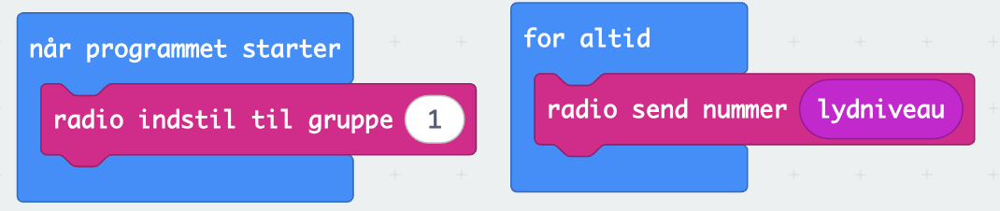
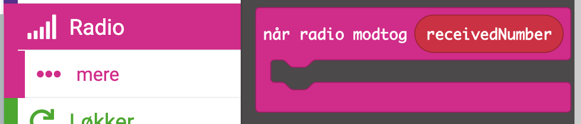
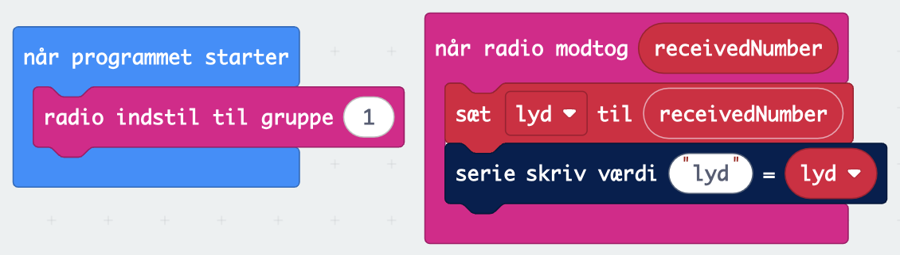

# Radio

Den sidste egenskab ved micro:bit vi vil præsentere i denne bog er radiokommunikation mellem to (eller flere) micro:bit. Vi vil tage vores lydmåler fra sidste afsnit og lave den om, så der er en måler, der sender lydniveau til en modtager. På den måde kan man måle lydniveau på afstand.

For at kunne bruge radio skal man have mindst to micro:bit. Vi skal skrive kode til begge micro:bit. Noget af koden er ens. Men noget af koden er forskellig. Der er en sender og en modtager i dette eksempel. Senderen sender konstant lydniveauet til modtageren, som sender det videre til computeren.

## Sender
Det første man skal gøre at bestemme hvilken kanal micro:bittene skal sende på. Det henter man i radiomenuen og indsætter i "når programmet starter"

Når man har valgt et tal i gruppen så kan vi sende lydniveauerne. 

Det er hele programmet for senderen.

## Modtager
Modtageren skal også indstilles til den samme gruppe som senderen. Når det er sket, så er den nødt til at vente på, at den modtager data. Til formål anvender man en anden type blok. 

Her kan man så læse tallet der er modtaget og sende det videre til computeren.

