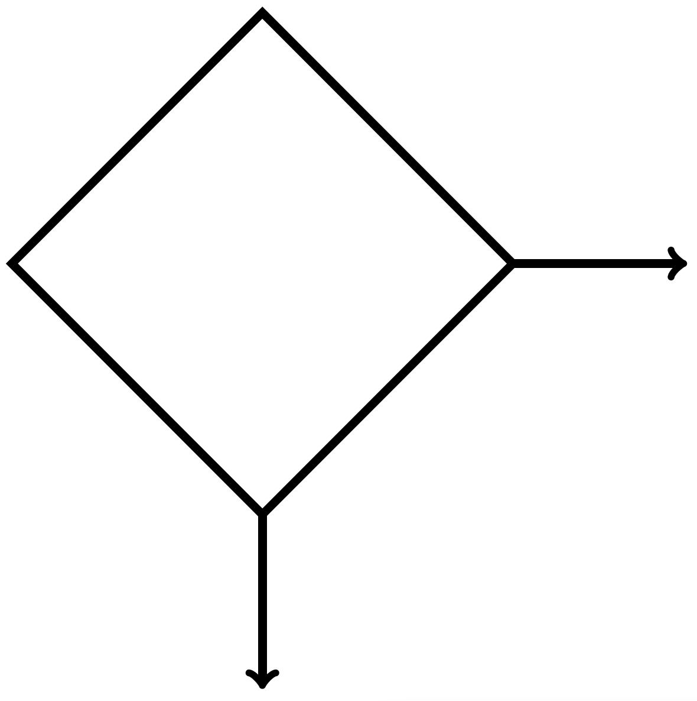
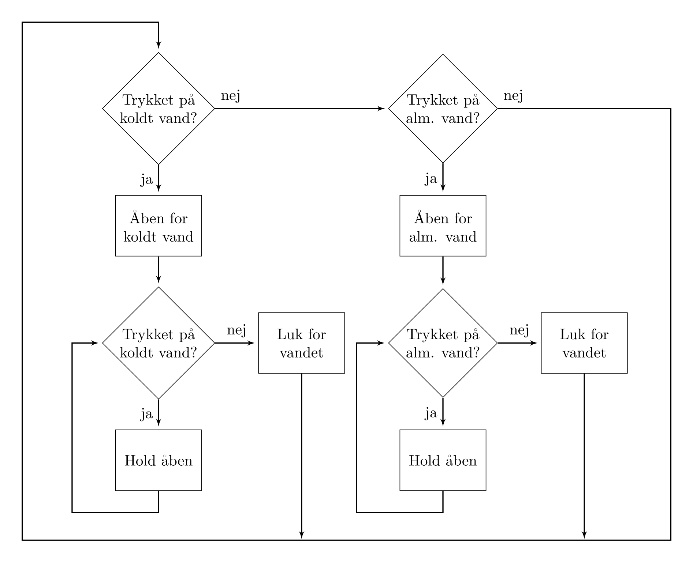

# Rutediagrammer

[Vandautomaten](./pc.md#et-eksempel) er rimelig simpel, hvis der bliver trykker på en knap skal der komme vand ud og hvis knappen slippes, skal vandet stoppes. En måde, at beskrive hvad en computer gør er ved et rutediagram. Et (simpelt) rutediagram består af to symboler en rektangel og en diamant. Disse figurer forbindes med pile. Et rektangel bliver kaldt en *proces* og en diamant blive kaldt en *forgrening*. Figurerne kan ses her under.

|||
|-|-|
|**Proces**: En proces angives med et rektangel. Der er præcis én pil fra rektangelen sat i dens bund. En proces beskriver en handling programmet skal gøre.|**Forgrening**: En forgrening angives med en diamant. Der er præcis to pile fra diamanten. En der peger ned og en der peger til højre. Forgreninger beskriver et valg programmet skal tage.|

Så en proces er én handling, også videre til den næste ting. Handlingen skrives inde i rektanglet. En forgrening angiver et valg. Man skriver et ja/nej spørgsmål inde i diamanten og man skriver ja eller nej ved den tilsvarende pil væk fra diamanten. Der må kun spørges om en *simpel* ting.

Vi viser nu et rutediagram for vandautomaten. Vi begynder med det symbol der er øverst til venstre og så følger vi pilene rundt.

Vi kan indfange de tre tilstand ved at se på, hvad programmet gør.

1. Der ventes. Det vil sige, at der ikke er trykket på nogen knapper. Hvis vi begynder øverst til venstre, vil vi støde på spørgsmålet "Trykket på koldt vand?". Det kan vi svare nej til, og følger pilen videre, så når vi til spørgsmålet "Trykket på alm. vand?", hvilket vi også siger nej til. Hvis følger nej-pilen ender vi tilbage til start.
2. Der er en der trykker på knappen til koldt vand. Hvis vi begynder øverst til venstre, vil vi støde på spørgsmålet "Trykket på koldt vand?". Det svarer vi ja til og følger pilen ned. Nu kommer vi til processen "Åben for koldt vand", som bliver udført og vi kommer til en ny forgrening: "Trykket på koldt vand?". Hvis der stadig bliver trykket på knappen til koldt vand, så kommer processen "Hold åben" og vi kommer tilbage til forgreningen. Det vil vi gøre indtil knappen slippes. Hvorefter vi følger nej-pilen, udfører processen "Luk for vandet" og følger pilen tilbage til start.
3. Der er en der trykker på knappen til almindelig vand. Lige som til koldt vand, bortset fra, at det er alm. vand, der åbnes for.

## Fra tilstandsdiagram til rutediagram

For at komme fra tilstandsdiagrammet for vandautomaten har vi set på hvilke tilstande, der er, og hvordan der skiftes imellem dem. Således er et skift i tilstand givet ved en forgrening, hvor der undersøges om betingelsen for skift af tilstand er tilstede, og hvis ja så skiftes der tilstand. Tilstandene er så kode, der udføres givet en bestemt tilstand. For eksempel at åbne for koldt vand, når vi er den tilstand. Denne oversættelse kan selvfølgelig vendes om. 

Det vil sige, at vi generelt har:
1. Skifte mellem tilstande oversættes til forgreninger.
2. En tilstand beskrives med processer og forgreninger, der passer til netop en tilstand.

Vi er nu klar til at skabe noget kode.