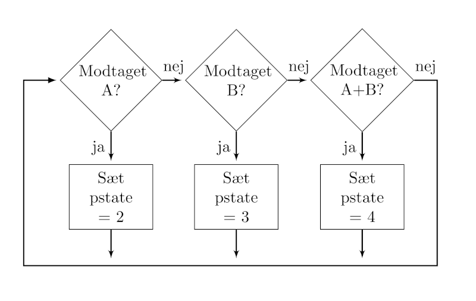

# Rutediagram

Vi kan nu lave et rutediagram for låsen. Udgangspunktet er, at vi har en enkelt variabel, der kaldes "pstate" (program state). Den sættes til 1, når programmet begynder. Dermed vil et overordnet rutediagram for den uendelige løkke se sådan ud:

Her er processerne under hver forgrening en funktion, der udfører det som skal ske i hver tilstand.

Vi mangler dog at forklare, hvordan vi kan skifte tilstand. Det afhænger faktisk af, hvad vi får tilsendt fra nøglen. Vi forestiller os, at den kan sende "A", hvis døren skal være åben i 6 sekunder, og der skiftes til tilstand 2. Den kan sende "B", hvis det er åben for altid og der skiftes til tilstand 3. Og den kan sende "AB", hvis døren skal låses, og der skiftes til tilstand 4. Dermed er skal der også at være et rutediagram for modtagelsen af beskeder fra radioen. Det ser sådan ud:

Vi skal så huske, at funktionerne "åben i 6 sekunder" og "luk" skal skifte til tilstand 1. 