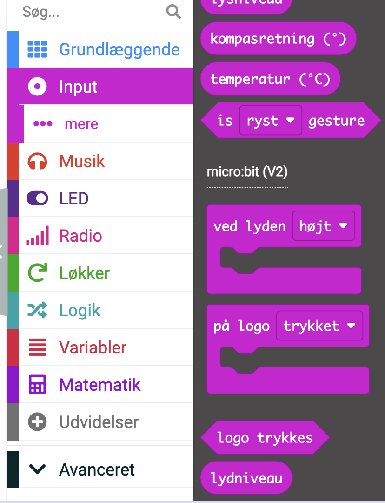
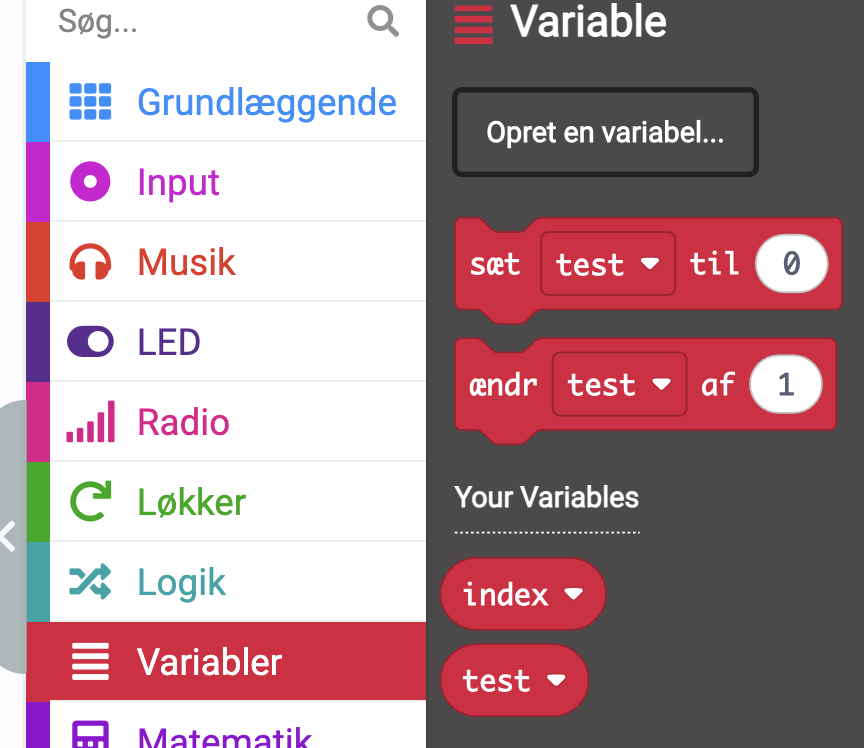
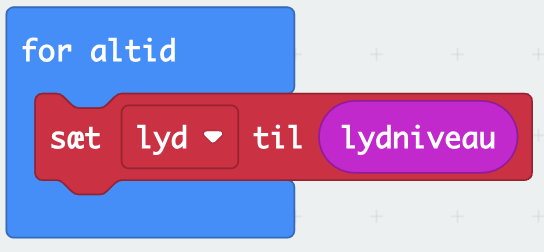
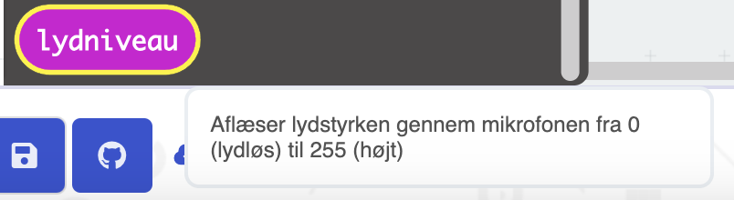
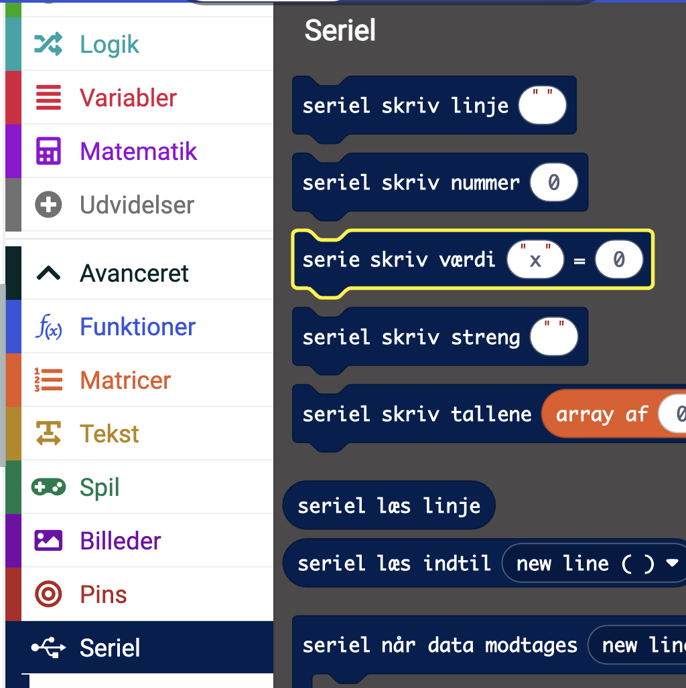
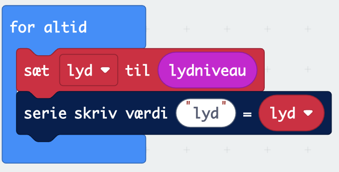
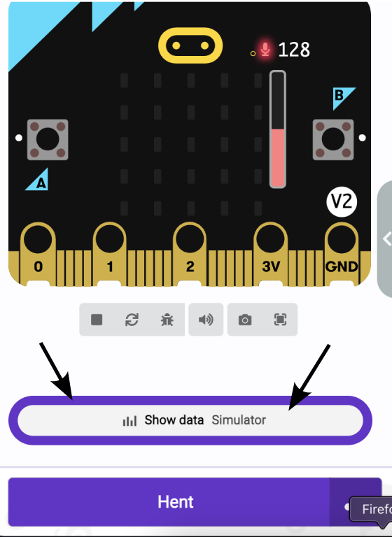

# Sensorer og variable

En micro:bit har mange sensorer, der måle for eksempel acceleration, temperatur, lysniveau, lydniveau og en del andet.

De fleste sensorer kan vi få adgang til under input.  Vi vil interesserer os for lydniveauet. Det kræver en micro:bit version 2. Hvis man ikke en sådan så kan meget af koden laves med lysniveau i stedet.

Lydniveau findes under input helt i bunden.

Hvis vi sætter denne blok ind i vores kode, vil vi se at det ikke går godt. Det skyldes at lydniveau er en talværdi, og vi er nødt til aflæse den og gemme den i en beholder. En sådan beholder kaldes en _variabel_. Variable laves under menupunktet med samme navn. Vi vælger opret.

Vi vælger navnet lyd, så ved vi, hvad variablen indeholde. 

Bemærk navne på variable kan være næsten hvad som helst. Anbefalingen er derfor, at vi vælger navne til variablene, der giver mening for os, og fortæller os noget om, hvad variablen indeholder. Lad være med at bruge navne som x og y, det fortæller os ikke noget.

Når vi oprettet vores variabel "lyd", så kan vi sætte den til værdien af lydniveauet.

Så nu har vi en variabel -- "lyd" -- der indeholder lydniveauet og som bliver opdateret, hver gang løkken begynder forfra. Men vi ved ikke, hvad lydniveauet er. 

Det første vi kan spørge os selv om er hvilke værdier, vi kan få ud af lydniveau. Ved at holde musen over lydniveau i menuen, kommer følgende frem.

Så vi får en værdi mellem 0 og 255 (svarende til en byte). Men hvor meget larmes der? Vi kan få micro:bitten til at sende data tilbage til vores computer og så kan vi få en graf og data, der viser lydniveauet.

Vi skal ned under Avanceret og Seriel. Der findes blokken vi skal anvende. 

Vi bruger næsten altid "Serie skriv værdi", fordi den tillader, at vi giver målingen et navn. Det er især praktisk, når vi har flere sensorer i gang. Vores kode ser nu således ud:

Vi kan så se grafer for lydniveauet ved at se efter "show data ..." Enten kan man simulere data, eller hvis man har en micro:bit tilkoblet se de rigtige målinger.

Målingerne kan gemmes som csv-fil.