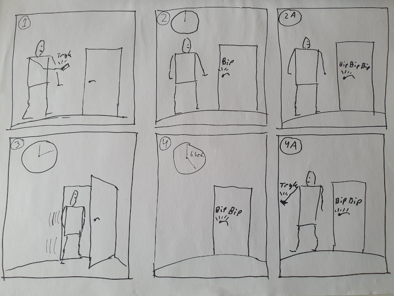

# Storyboard

Der findes rigtig mange måder beskrive, dokumentere, eller vise hvad en prototype kan. En forholdsvis hurtig metode er at indfange de(n) situationer, hvor prototypen anvendes i et storyboard.

Et storyboard en række billeder, der til sammen fortæller en historie. Vi giver et eksempel.

Storyboardet oven for viser seks billeder, der alle har et lille tal i øverste venstre hjørne. I billede 1 er der en person, der trykker på en eller anden ting i hånden. Resultatet af det tryk kan ses i billede 2 og 2A (A for alternativ). Hvor døren bipper en eller tre gange. I billede 3, går personen ind af døren , hvilket leder til billede 4 og 4A. I billede 4 går der 6 sekunder, og så siger døren bip to gange. I det alternative billede 4A går personen igen, men der trykkes på noget i hånden. Døren bipper to gange. Du har nok regnet ud, at der er tale om en trådløs lås ligesom til biler.

Et storyboard indfanger med andre ord anvendelsen af en prototype. Særligt kan et storyboard beskrive en prototype, der _ikke_ eksisterer endnu. Det er især evnen til at beskrive fremtiden, der gør prototyper interessante i en designsammenhæng.

Vi kan give nogle gode råd til, hvordan et storyboard med fordel kan skabes:
* En handling i en ramme.
* Giv rammerne et tal, så er det lettere at holde styr på rækkefølgen, især hvis du glemmer et billede, og skal tilføje det senere.
* Tegn rektangulære kroppe og ovale hoveder. En rektangulær krop kan lettere vise, hvor den er på vej hen. Et ovalt hovede, kan lettere vise, hvor det kigger hen.
* Spild ikke tid på at tegne for pænt.
* Skriv vink på tegningerne. For eksempel, lyde, tider, og så videre.
* Et storyboard behøver ikke vise en situation, hvor tingene går godt. 
* Nogen gange kan det være nødvendigt med flere storyboards. 