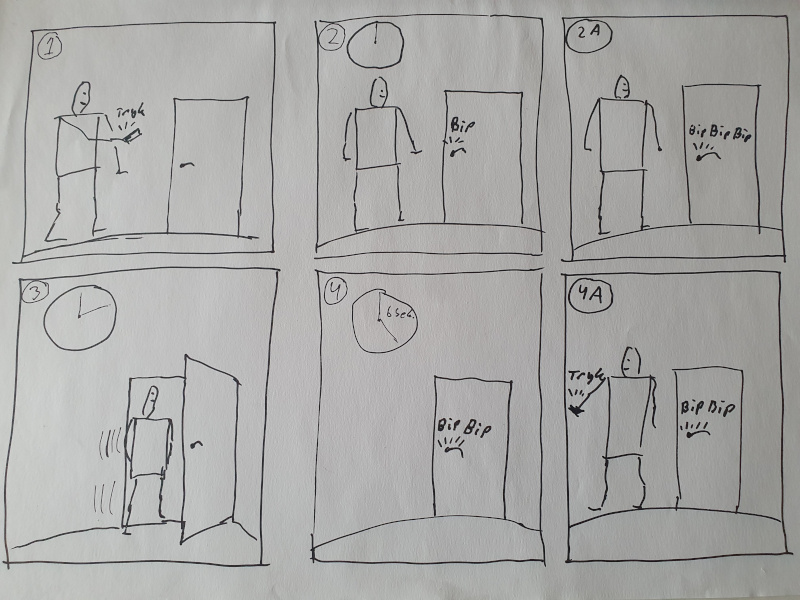

# Storyboard
Vi har nu en situation omhandlende døre. Et storyboard på baggrund af situationen kan se sådan ud:

I billede 1 er vi på vej hen til døren, og trykker på vores nøgle for at få døren til at låse op. Der er to muligheder 2 og 2A (A for alternativ). I situation 2 låser døren op, og den er låst op i 6 sekunder (se billede 4). I Situation 2A, har låst op så døren forbliver oplåst. I billede 3 går vi ind ad døren. I billede 4 er der gået 6 sekunder, og døren låser. I billede 4A går vi fra døren, men husker at låse den.

På denne måde har vi indfanget situationen. Vi kan nu lave et tilstandsdiagram. Der er to ting som umiddelbart kan ses ud af storyboardet, nemlig at vi skal anvende to enheder, en som nøgle og en som lås. Og de skal kunne kommunikere over radio. 

Vi vil derfor bruge ordet "nøgle", om den micro:bit brugeren har i hånden og ordet "lås" om den micro:bit, der spiller rollen som lås.