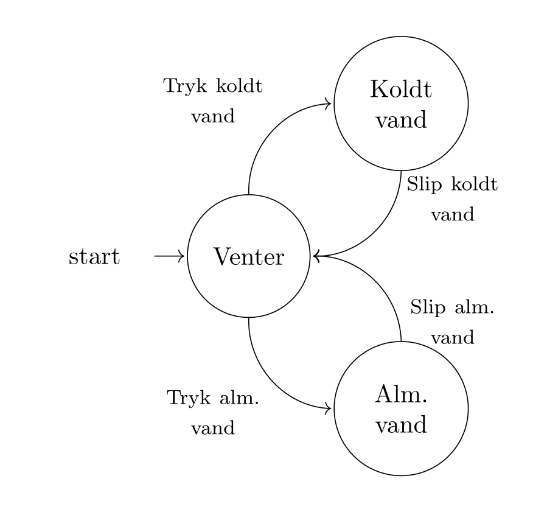

# Tilstandsdiagrammer
Tilstands diagrammer er en måde at grafisk repræsentere det en computer gør eller viser os brugere. I eksemplet med [vandautomaten](./pc.md#et-eksempel) kan vi identificere tre ting automaten gør. Den første er, at den ingenting gør -- den venter bare. Hvis man trykker på knappen til koldt vand, så sker der noget, nemlig at der kommer koldt vand ud af automaten. Her er tilstanden nu, at der kommer koldt vand ud. Hvis vi trykker på den anden knap, så kommer der almindelig vand ud. Så den sidste tilstand er, at automaten at der kommer almindelig vand ud.

Så vi har tre tilstande
1. Venter på tryk på en knap
2. Sender koldt vand ud
3. Sender almindelig vand ud

Det interessante er så, hvordan vi kommer fra en tilstand til en anden. Svaret er at vi enten trykker på en knap (og holder den nede), eller vi slipper knappen. 

Vi kan indfange det ovenstående i et tilstandsdiagram. Et (simpelt) tilstandsdiagram består af to grafiske elementer
1. **Cirkler** angiver tilstande og inde i cirklen skriver man, hvilken tilstand systemet er i.
2. **Pile** angiver skift i tilstande. Pilen viser hvilken tilstand der startes i og hvilken tilstand der sluttes i. Pilene udstyres med en tekst, der fortæller, hvad der får tilstanden til at skrifte.
3. Vi skal også angive hvor systemet starter.

Et tilstandsdiagram for vandautomaten ses her.

Tilstandsdiagrammet giver os et overblik over, hvad systemet gør, og hvordan ændringer sker i systemet. Men vi er stadig på et overordnet niveau, vi skal tættere på computeren. Til det formål har vi rutediagrammer.