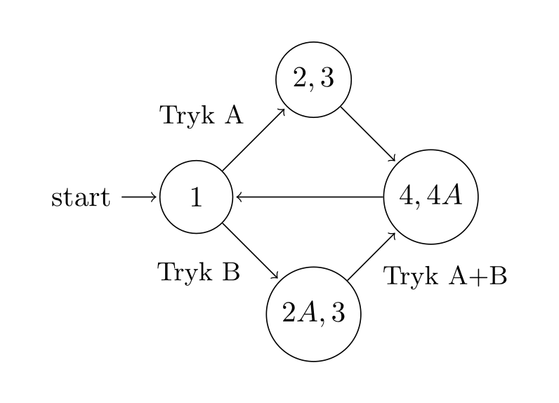

# Tilstandsdiagram
På baggrund af vores storyboard kan vi nu lave et tilstandsdiagram. Men først bemærker vi, at det ikke er nøglen, der skal laves et tilstandsdiagram for. Den sender "bare" tre beskeder: Lås op i 6 sekunder, lås op på ubestemt tid, og lås døren.

Derfor ser vi på låsen. Umiddelbart er der to situationer, enten åbnes døren i 6 sekunder, eller også er den bare åben (billede 2 og 2A). Derfra er der forskellige veje.

Et tilstandsdiagram, hvor tallene i tilstandene er henviser til billederne i [storyboardet](./storyboardeks.md), kan se sådan ud:

Vi forestiller os, prototypen skal laves med micro:bit, så der er også angivet hvilke tryk på micro:bitten, der giver hvilket resultat. Det giver os 4 tilstande. 
1. En grundtilstand, hvor døren er låst. (tilstand 1)
2. En tilstand, hvor døren er åben i 6 sekunder. (tilstand 2,3)
3. En tilstand, hvor døren er åben indtil den bliver låst. (tilstand 2A,3)
4. En tilstand, hvor døren låser. (tilstand 4,4A)

Disse fire numre (1-4) fra punktopstillingen vil vi anvende i koden og i rutediagrammerne.