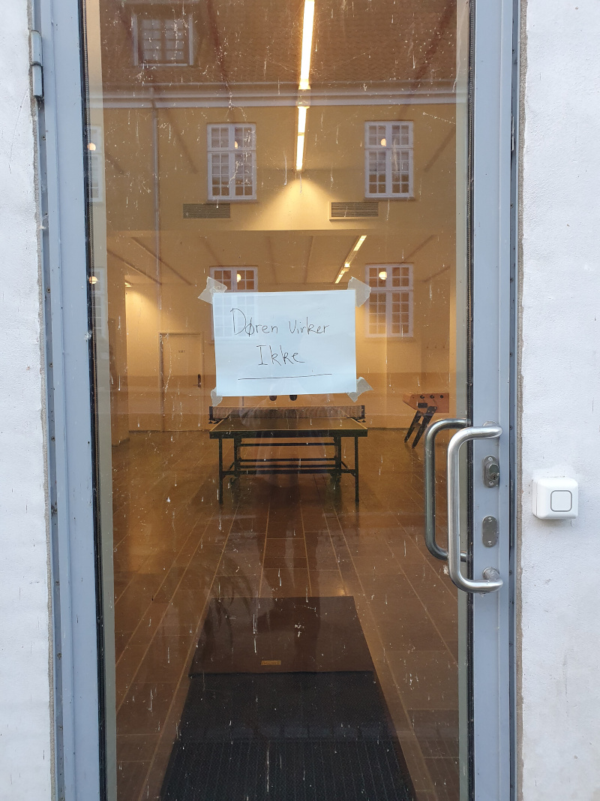
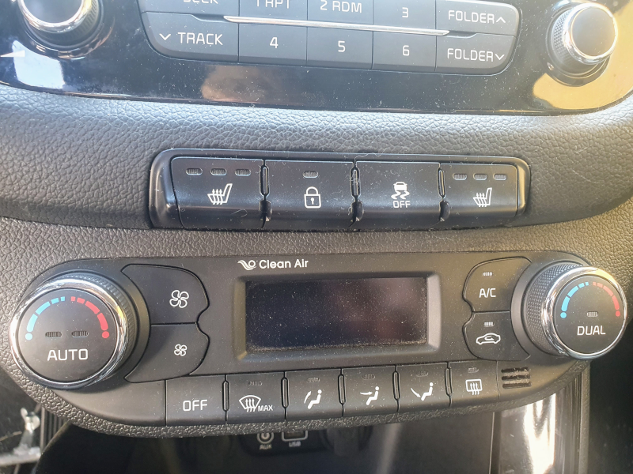

# Visibility

Visibility princippet defineres til at være:

|Definition: Visibility|
:-|
|Giver ting mulighed for at se status, og hvad der er muligt at gøre med tingen?|

Med andre ord, kan vi se hvad tingen gør nu eller kan nu? Kan vi se hvad tingen vil have os til?

## Et eksempel på dårlig visibility

I virkeligheden ville der være tale om dårlig visibility, hvis skiltet om at døren er i stykker ikke var der. Men det viser jo netop, at vi ikke kan se på en dør, og afgøre om den er i stykker. Typisk ville vi heller ikke kunne se om sådan en dør er låst. Så generelt er døre noget med begrænset visibility.

## Et eksempel på god visibility

Gammeldags knapper i biller, der også har små lys, der viser om de er trykket ind, har høj visibility. Her kan man umiddelbart ses status og det umiddelbart let at se hvad der er af muligheder.